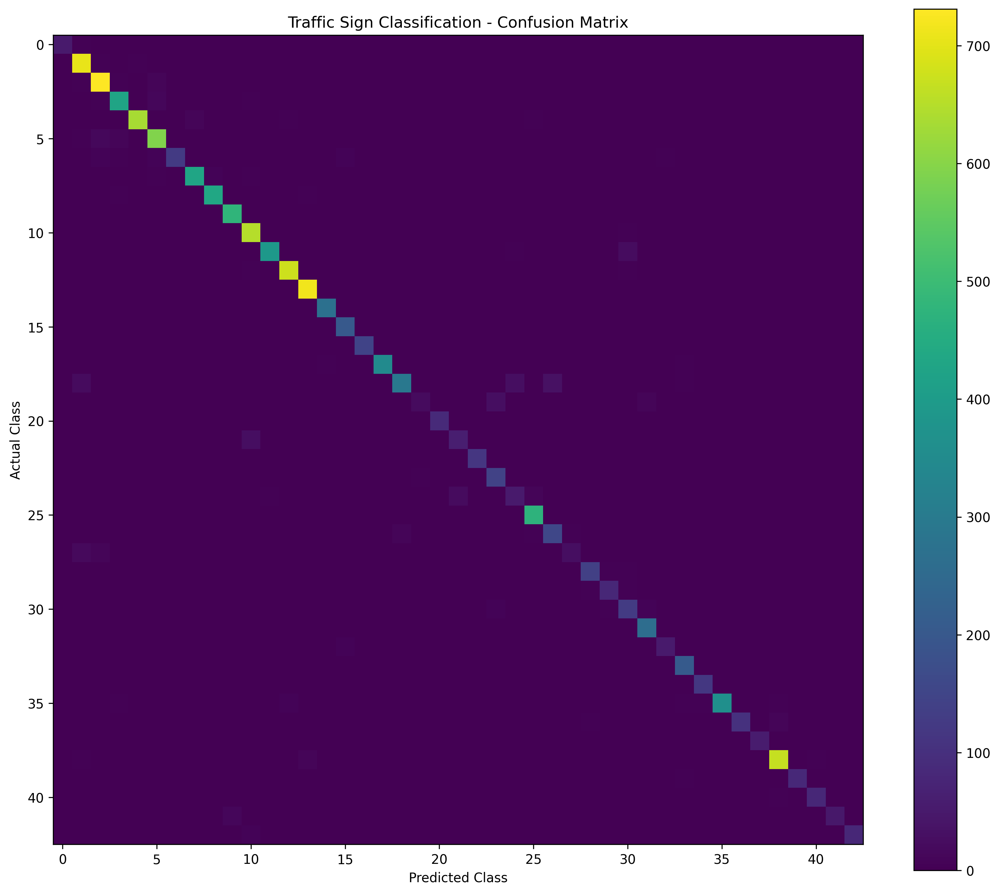
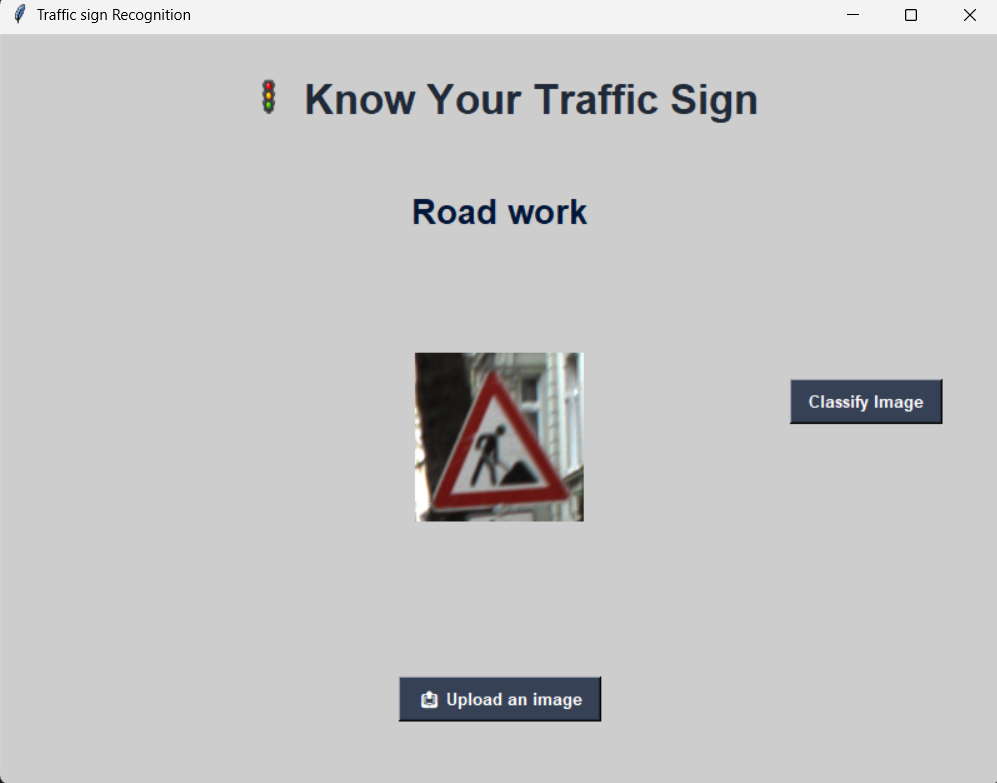

# Traffic Signs Recognition

A CNN-based deep learning project that recognizes and classifies traffic signs from images into 43 different categories.

## 🎯 Objective

The main objective of this project is to develop a computer-vision-based system that can automatically identify traffic signs from uploaded images using a Convolutional Neural Network (CNN).

## 🚦 Features

- Upload a traffic sign image
- Preprocess the input image
- Classify the image using a trained CNN model
- Recognize 43 different traffic sign categories
- Display the predicted traffic sign through a Tkinter GUI

## 🧠 Project Workflow

Image Upload  
↓  
Image Preprocessing  
↓  
CNN Model  
↓  
Prediction  
↓  
Traffic Sign Classification

## 📊 Dataset

The model was trained using the **German Traffic Sign Recognition Benchmark (GTSRB)** dataset.

The dataset contains images belonging to 43 different traffic sign classes.

The dataset itself is not included in this repository because of its size.

## 📈 Model Performance

The trained CNN model was evaluated on the GTSRB test dataset.

| Metric | Score |
|---|---:|
| Accuracy | 94.35% |
| Precision | 94.46% |
| Recall | 94.35% |
| F1-Score | 94.22% |

The model classifies traffic signs across 43 different classes.

## 📊 Confusion Matrix

The confusion matrix shows the classification performance across all 43 traffic sign classes.



## 🖥️ Application Demo

The Tkinter-based GUI allows users to upload a traffic sign image and receive the predicted traffic sign classification.



## 🛠️ Technologies Used

- Python
- TensorFlow
- Keras
- NumPy
- Pillow
- Tkinter
- CNN
- Computer Vision

## 📁 Project Structure

```text
Traffic-Signs-Recognition/
│
├── src/
│   ├── traffic_sign.py
│   └── my_model.h5
│
├── results/
│   └── confusion_matrix.png
│
├── gui.py
├── evaluate.py
├── requirements.txt
├── traffic_light_image.png
├── .gitignore
└── README.md